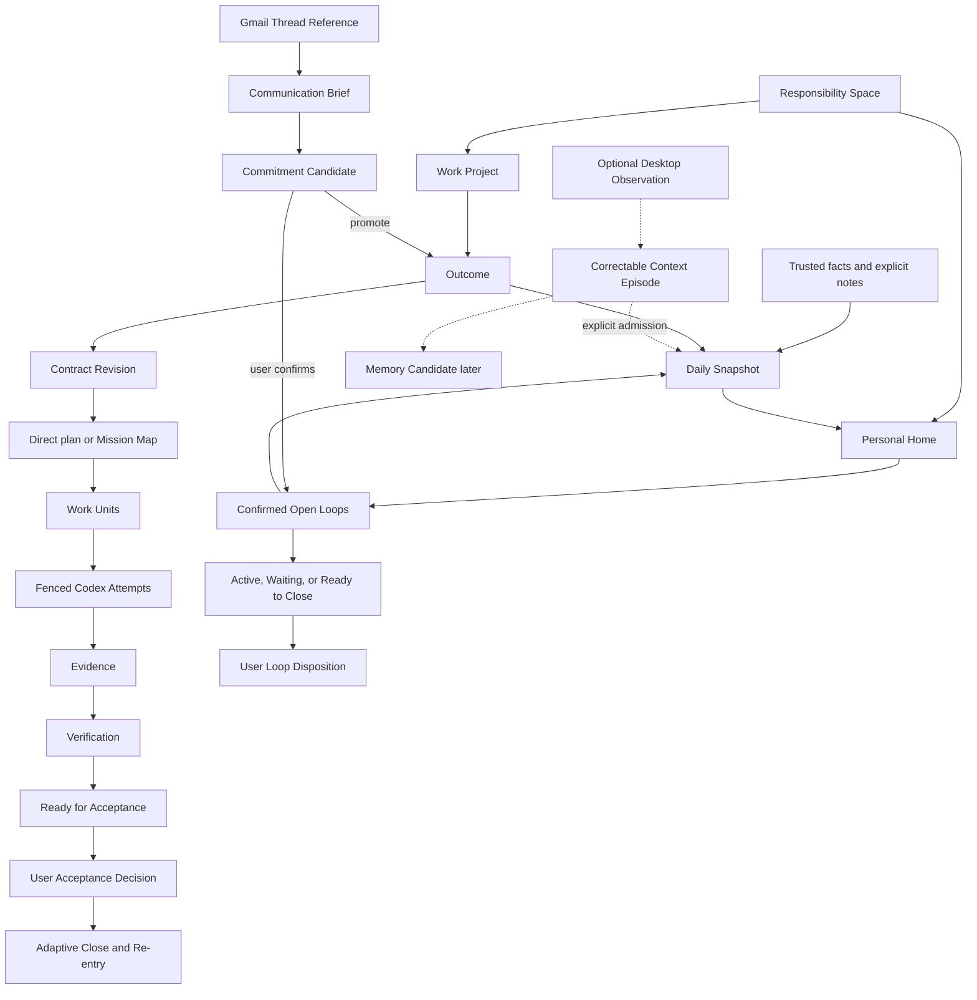
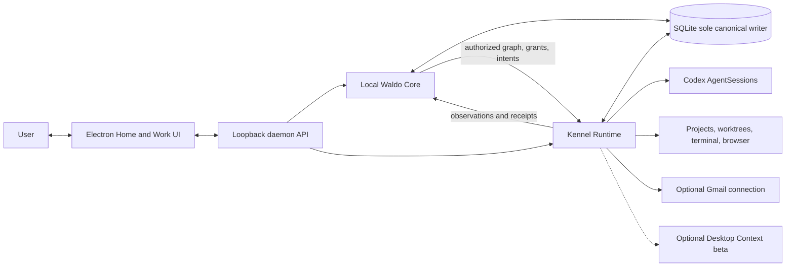

# Waldo Kennel desktop launch team review packet

- Status: Team review baseline; documentation and prototype only
- Date: 2026-08-20
- Audience: founders, product, design, engineering, privacy, and security
- Canonical source: [desktop launch product architecture](kennel-v1-product-architecture.md)
- Implementation status: not implemented

This packet is the shareable review view of the accepted Waldo Kennel desktop launch. It combines the Kennel Work loop with a local Personal Home, confirmed Open Loops, Daily Snapshot, a bounded Gmail Communication Loops beta, and a later opt-in Desktop Context beta. It is not a claim that current code or PR #11 already implements these decisions.

Companion artifacts:

- [Clickable low-fidelity prototype](kennel-v1-review-prototype.html)
- [Excalidraw collaboration seed](kennel-v1-excalidraw-session-seed.md)
- [Canonical architecture](kennel-v1-product-architecture.md)
- [Local-first deployment decision](../adr/0003-local-first-waldo-core.md)
- [PR convergence plan](../superpowers/plans/2026-08-20-pr-convergence-and-architecture-gate.md)

## 1. Evidence and decision labels

| Label | Meaning |
| --- | --- |
| **Locked** | Accepted for this architecture baseline; changing it requires another explicit decision. |
| **Observed** | Directly inspected in code, repository, API documentation, or a dry run. |
| **Reported** | Supplied by a person or external system but not independently reproduced here. |
| **Inference** | Evidence-based interpretation or likely consequence. |
| **Proposed** | Concrete design awaiting a future decision. |
| **Unknown** | Material detail not established. |

Messages, model text, commits, PRs, checks, screenshots, activity, and provider completion are never silently promoted from Observed to accepted user truth.

## 2. Executive decision

### Locked

- Waldo is one user-owned intelligence and responsibility identity. Kennel is its local Mac presence, not a separate assistant.
- The launch product has three primary destinations: **Home**, **Work**, and **Settings & Control**.
- Work remains the launch spine for agent-heavy Mac users: Outcome to verified Acceptance with lower supervision cost.
- Home adds confirmed Open Loops, trusted Daily Snapshot, concise attention, communication continuity, and exact Re-entry without claiming durable Memory or complete life understanding.
- Gmail Communication Loops is an optional bounded beta: read actionable threads, propose correctable commitments, confirm an Open Loop or Outcome, create a user-requested draft, track Waiting, and consciously close. It never auto-sends or auto-closes.
- Desktop Context is launch+1, separately consented, optional, local, correctable, and never automatic Memory/Evidence/authority.
- Local Waldo Core runs inside the daemon. Electron is a thin supervisor. Local SQLite is the sole canonical writer.
- No account, hosted Waldo API, Waldo-funded model, or central Memory service is required for launch.
- Codex is the only provider selectable for new Work Attempts. Historical providers remain readable and retain original identity.
- Provider completion, commits, PRs, checks, Verification, messages, and drafts never create Acceptance or Open Loop closure.
- All consequential effects have an EffectIntent before I/O and an EffectReceipt after reconciliation.
- Hosted attachment, durable Memory, Relationship, Health/mobile, durable proactive agent, Waldo-owned harness, teams, marketplace, and commercialization remain later.

### Observed

- F0-F6 already supplies an AO-derived Go daemon, trigger-based SQLite change events, Electron, Projects, worktrees, provider sessions, terminal/browser, recovery facts, and code-review observations.
- The current Outcome overlay is session-oriented and is not the accepted Outcome/Open Loop model.
- PR #11 mixes useful cleanup with an unwired permanent Outcome store that omits required CDC, revision, evidence, acceptance, effect, and recovery semantics.
- Gmail desktop access can avoid a Waldo backend through installed-app OAuth and incremental polling, but public inbox/draft scopes require Google verification.
- Dayflow proves useful local observation/timeline mechanisms; it does not prove intention, whole-life context, or governed durable Memory.

### Inference

- The coherent product is not “coding agents plus an inbox plus screenshots.” It is one governed responsibility system with multiple sources and bounded executors.
- Launch value comes from reducing coordination burden: less context reconstruction, fewer reducible interruptions, clearer authority, safer recovery, and faster conscious closure.
- Gmail broadens the proof from agent execution to human coordination, but should not delay the Work core if OAuth/privacy gates are not ready.

## 3. Launch promise, users, and problems

> Give Waldo something that must become true—or something you cannot afford to forget. Kennel clarifies the responsibility, chooses the smallest safe next action, executes or drafts within explicit authority, returns Evidence instead of claims, and brings you back only for judgment, human-only action, or conscious closure.

| User/job | Problem today | Launch mechanism | Falsifier |
| --- | --- | --- | --- |
| Technical founder/developer delegates code work | Intent, plan, permissions, and proof are buried in sessions. | Outcome contract, Mission Map, Work Units, Codex Attempts, Evidence, Verification, Acceptance. | More supervision than direct Codex. |
| User returns after interruption | They reconstruct branches, sessions, messages, and next steps. | Causal trace, Recovery receipt, Daily Snapshot, Re-entry packet. | Full transcripts still required routinely. |
| User receives an important email | The actual ask, owner, due condition, and next action are unclear. | Communication Brief and correctable Commitment Candidate. | False commitments become canonical. |
| User waits on another person | A quiet thread is forgotten or incorrectly considered done. | Open Loop with owner, trigger, next review, and closure condition. | Archive/inactivity silently closes it. |
| User needs work-plus-personal continuity | A repository Project cannot represent every responsibility. | Personal Home Responsibility Space and explicit Quick Capture. | Product invents fake Projects or opaque life claims. |

## 4. Final ontology

### Roots and responsibility

| Object | Meaning | Never confuse with |
| --- | --- | --- |
| `ResponsibilitySpace` | Policy/context/retention boundary: Work Project or Personal Home. | UI tab, provider, account. |
| `Project` | Local executable workspace inside a Work Project space. | Outcome, personal area. |
| `Outcome` | Something the user delegates to become true. | Task, session, PR, message thread. |
| `OpenLoop` | Confirmed unresolved responsibility/commitment to revisit or close. | Inferred TODO, inactive thread, failed command. |
| `ContractRevision` | Immutable Outcome goal, criteria, constraints, authority, review, stop. | Editable chat summary. |
| `PlanRevision` | Versioned execution proposal. | Mission as a second Outcome. |
| `MissionMap` | Optional understandable projection of PlanRevision. | Canonical responsibility. |
| `LoopDisposition` | Immutable confirm/close/release/reopen/transfer decision. | Automatic status inference. |
| `SuccessorLink` | Explicit follow-up lineage. | Mutation of accepted/closed history. |

### Execution and control

| Object | Meaning | Invariant |
| --- | --- | --- |
| `WorkUnit` | Smallest bounded schedulable part of a plan. | Frozen requirements/evidence/recovery for each Attempt. |
| `Attempt` | One execution of one WorkUnit. | Retry/fallback creates another Attempt. |
| `AgentSessionRef` | Provider-native session reference. | Session completion is not Outcome completion. |
| `CapabilityGrant` | Scoped read/write/execute/disclose/spend/effect authority. | Lower layers may narrow, never widen. |
| `DecisionRequest` | Irreducible user judgment with recommendation and consequence. | Generic notification or error. |
| `EffectIntent` | Frozen proposed consequential action before I/O. | Tool call or model request. |
| `EffectReceipt` | Reconciled actual effect, including unknown. | Assumed success. |

### Proof and closure

| Object | Meaning | Invariant |
| --- | --- | --- |
| `EvidenceItem` | Provenance-bearing support/contradiction tied to a criterion and subject. | Provider assertion. |
| `VerificationRun` | Method/verifier/subject/result/exceptions. | Acceptance. |
| `AcceptanceDecision` | Immutable user accept/reopen decision. | Check pass or reviewer approval. |

### Communication and personal context

| Object | Meaning | Admission rule |
| --- | --- | --- |
| `SourceConnection` | Explicitly authorized source such as one Gmail account. | Scope, disclosure, retention, revoke, and sync state visible. |
| `CommunicationThreadRef` | External conversation reference and provenance. | Never canonical responsibility identity. |
| `CommitmentCandidate` | Correctable inferred ask/obligation/owner/due/next step. | User confirms before OpenLoop/Outcome creation. |
| `DraftEffect` | Gmail-draft EffectIntent/Receipt. | Does not mean sent, acknowledged, or closed. |
| `DailySnapshot` | Time-bounded projection from trusted facts and confirmed items. | Not Memory, productivity scoring, or whole-life truth. |
| `DesktopObservation` | Optional untrusted capture-derived observation. | Never authority, Evidence, or Memory automatically. |
| `ContextEpisode` | Correctable grouping of DesktopObservations. | Explicit link/admission required. |
| `MemoryCandidate` | Later durable-continuity proposal. | Provenance, correction, expiry, rollback, deletion required. |

## 5. Unified lineage and governance graph

### Governance invariants

1. User statements outrank behavioral inference.
2. Model output proposes; deterministic daemon code validates and transitions.
3. No execution or effect begins without the current contract/grant/intent gate.
4. Provider/session state, communication activity, and desktop observation never become responsibility truth automatically.
5. Unknown effects are contained and reconciled before any retry.
6. Acceptance and LoopDisposition belong to the user.
7. Accepted/closed history is immutable; follow-up creates a successor.
8. Raw private sources stay local or cross a named disclosure boundary with explicit consent.

## 6. Local architecture and custody

| Local Waldo Core owns | Kennel Runtime owns |
| --- | --- |
| Responsibility/continuity semantics | Repository and workspace bytes |
| Contracts, plans, Work Units | Worktrees, processes, terminal/browser |
| Authority requirements and decisions | Provider auth, credentials, AgentSessions |
| Effect Intents, Evidence metadata, Verification | Raw artifacts, traces, source content, receipts |
| Acceptance, LoopDisposition, lineage | Recovery observation and reconciliation |
| Attention, Communication Brief, Daily Snapshot | Connector and optional capture I/O |

Hosted Waldo is not a launch dependency. After an explicit future attachment, it may become canonical for the attached space's semantics and metadata; Kennel retains local execution/raw custody. Dual canonical writers are forbidden.

## 7. Final information architecture

### Home

The user sees responsibility and attention across spaces:

- Today brief and trusted Daily Snapshot;
- Needs You and Action Required;
- Open Loops, Waiting, follow-ups, and Ready to Close;
- actionable Communication Loops beta;
- Quick Capture and correction;
- recent accepted Outcomes and exact Re-entry.

Home is not an activity feed, raw inbox, screenshot timeline, or Memory dashboard.

### Work

- Projects and readiness;
- Outcome Focus, Active Outcomes, Waiting, Ready for Acceptance, and recent closes;
- Outcome Workspace: Define, Clarify, Mission Map, Authority, Run, Review, Accept, Close/Re-enter;
- contextual operator inspector for Attempt, terminal, worktree, browser, trace, and recovery.

### Settings & Control

- Responsibility Spaces and Projects;
- Codex admission/authentication and historical-provider inspection;
- Gmail connections and sync/privacy/disclosure state;
- permissions, effects, retention, export, revoke, deletion;
- skills, MCP, rules, optional Desktop Context;
- hosted attachment visibly Later.

## 8. Screen and state review matrix

| Screen | Primary question/action | Essential states |
| --- | --- | --- |
| Onboarding | Establish Personal Home and optionally add a Work Project. | first run, no Project, invalid folder, Codex unavailable, ready, offline. |
| Home / Today | What needs me now? | empty, normal, high attention, stale, offline, recovering. |
| Quick Capture | What should Waldo preserve? | note/OpenLoop choice, duplicate, space assignment, defer. |
| Daily Snapshot | What happened, what remains open, what comes next? | collecting, partial, ready, corrected, Daily Close. |
| Communication Inbox | Which conversations contain potential responsibility? | disconnected, authorizing, syncing, ready, stale, revoked, empty. |
| Communication Brief | What is the actual ask and recommended next action? | uncertain candidate, corrected, confirmed OpenLoop, promoted Outcome, dismissed. |
| Draft Review | May Kennel create this exact Gmail draft? | intent, approval, created, edited, failed, unknown/reconciled, sent externally. |
| Open Loop Detail | Who owns what, when do we recheck, and what closes it? | active, waiting, deferred, ready to close, closed, released, reopened, transferred. |
| Work Home | Which Outcomes require attention? | empty, active, Needs You, Action Required, Waiting, Ready for Acceptance. |
| Outcome Define | What must become true and how will we review it? | vague success, conflicts, local-only, draft revision. |
| Clarification | Which one material decision changes the contract? | recommended choice, custom answer, defer, contradiction. |
| Mission Map | Is this the smallest sufficient topology? | direct one-unit, graph, invalidated, capability/budget conflict. |
| Authority | What may happen, where, until when, and how is it revoked? | new grant, missing auth, external effect, changed revision. |
| Run | What is happening and what is Waldo's next safe action? | queued, running, paused, failed, lost, reconciled, retry, partial Evidence. |
| Needs You | Which irreducible judgment must I make? | recommendation, alternatives, consequence, expiry, inspect. |
| Action Required | What exact human-only step must I perform? | sign-in, permission, denial, completed elsewhere, resume. |
| Waiting | Why is action not useful yet? | dependency, timeout, failure, manual refresh, transfer. |
| Evidence & Verification | Does current Evidence support each current criterion? | missing, stale, contradicting, failed check, exception, verifier conflict. |
| Acceptance | Is this responsibility handled? | accept, request rework, revise active, release. |
| Adaptive Close | What should remain open or be cleaned up? | dirty worktree, retained artifact, OpenLoop, suggested successor. |
| Re-entry | What minimum context restores useful action? | successor Outcome, reopened loop, missing source, historical provider unavailable. |
| Desktop Context beta | What may be observed and retained? | disabled, permission denied, paused, excluded app, storage cap, delete. |
| Settings | What can I inspect, limit, export, revoke, or delete? | provider mismatch, connection revoked, deletion confirmation, attachment unavailable. |

## 9. End-to-end UX flows

### A. First run

1. Kennel creates local Personal Home and explains local custody.
2. The user may add a Work Project immediately or later.
3. Codex readiness appears only when the user enters Work or defines an executable Outcome.
4. Gmail and Desktop Context are optional, separately explained connections—not onboarding blockers.

### B. Daily Home

1. Home opens on the smallest current brief: what needs judgment, action, waiting, or closure.
2. Daily Snapshot uses trusted Kennel facts, confirmed items, and explicit notes.
3. The user can correct, dismiss, capture, defer, or open exact source context.
4. Daily Close records what remains open and creates tomorrow's Re-entry; it does not maximize closure count.

### C. Work Outcome

1. Outcome Focus accepts normal language.
2. Goal, Success, and Review are always visible; Plan and Authority expand as risk warrants.
3. One material clarification at a time creates a frozen ContractRevision.
4. Simple work compiles directly; complex work shows a Mission Map.
5. User approves authority; Kennel admits a fenced Codex Attempt.
6. Run shows Work Units and Waldo's next safe action, not transcript volume.
7. Evidence is grouped by criterion; Verification is independent by class.
8. User Accepts, requests rework, revises active work, or releases.
9. Adaptive Close preserves accepted history and creates successors/Open Loops as needed.

### D. Communication Loop

1. User connects one Gmail account with explicit scope/disclosure/retention notice.
2. Kennel polls incrementally and shows only actionable candidates, not the whole inbox.
3. Communication Brief states the ask, owner, due/trigger, what happened, and Waldo's recommended next action.
4. User dismisses, corrects, confirms an Open Loop, or promotes to an Outcome.
5. If requested, an exact draft EffectIntent is reviewed and created; user sends from Gmail.
6. The Open Loop becomes Waiting with owner and recheck condition.
7. A reply or user update produces a concise change brief and next action.
8. Waldo proposes Ready to Close; user closes, releases, reopens, or promotes remaining work.

### E. Optional Desktop Context

1. User separately enables capture, analysis route, provider disclosure, exclusions, retention, and deletion.
2. Raw frames remain local and short-lived; observations are untrusted.
3. Episodes are correctable and never become responsibility, Evidence, rules, skills, or Memory automatically.
4. Explicitly confirmed episodes may inform a Daily Snapshot or Commitment Candidate.

## 10. Failure, privacy, and recovery

| Failure | Product response |
| --- | --- |
| Codex missing/unauthenticated | Action Required with exact step and completion signal; no Attempt admitted. |
| Capability mismatch | Replan within authority or Needs You; never pretend parity. |
| Lost process/restart | Fence stale writes, preserve worktree, reconcile effects, resume or create a new Attempt. |
| Dirty/overlapping worktree | Block destructive cleanup/competing ownership; serialize, replan, or ask judgment. |
| Verification failure | Keep Outcome active; bind failure to current criterion and rework affected Work Unit. |
| Effect result unknown | Stop repeats, query authoritative state, record unknown receipt, reconcile before retry. |
| Gmail auth/sync failure | Preserve local loops, mark source stale, give exact reconnect/revoke path; never infer closure. |
| Prompt injection in message/source | Treat all inbound content as untrusted data; source text cannot grant capabilities or issue instructions. |
| Desktop capture denied/paused | Keep Home useful from trusted Kennel facts; show partial source truth without pressure. |

Canonical traces exclude raw prompts, email bodies, files, terminal output, screenshots, credentials, health values, and model chain-of-thought. Private excerpts are explicit minimized local attachments. Disclosure destination, reason, and policy are inspectable.

## 11. Launch scope and sequence

### Launch core

1. Foundation acceptance and truthful local projections.
2. Personal Home, Work, and Settings shell.
3. ResponsibilitySpace, Outcome/OpenLoop domain spine and causal trace.
4. Define/Clarify/Mission/Authority.
5. Fenced Codex WorkUnit/Attempt execution and recovery.
6. Attention, Evidence, Verification, Acceptance, Close, and Re-entry.
7. Trusted Daily Snapshot and explicit Quick Capture.
8. Dogfood/falsification gate.

### Optional launch beta

9. One-account Gmail Communication Loops: brief, candidate, confirm, draft, waiting, close/re-entry.

The beta may remain internal while Google OAuth verification and model-disclosure/security assessment are unresolved. Work core must not wait on it.

### Launch+1

10. Optional Dayflow-inspired Desktop Context after core stability and separate privacy acceptance.

### Later ecosystem

- Hosted attachment and cross-device sync;
- durable Memory and consented Paxel/AutoResearch-style learning;
- Relationship, Health First mobile, body-state planning;
- durable proactive Waldo, Waldo-owned harness, broader providers;
- teams, marketplace, pricing, and commercialization.

## 12. Resolved architecture defaults

- One active write lease per worktree with monotonic fence; stale events cannot mutate current state.
- Sequential execution by default; concurrency only in isolated non-overlapping worktrees approved in the Mission Map.
- No provider fallback; new work is Codex-only.
- Every RunBrief freezes IDs, objective, dependencies, workspace, grants/effects/disclosure, Evidence/Verification, budget, stop/recovery/handoff.
- Deterministic checks execute outside the producing session. Semantic criteria need an independent review Attempt or user walkthrough.
- Local worktree read/write/commands may be authorized; local commits must be explicit. No autonomous push, PR, comment, merge, deploy, publish, release, payment, destructive remote effect, or message send.
- Gmail draft creation requires a user-requested EffectIntent. Send/archive/delete/labels/closure are not automated.
- Causal trace is metadata-first and private-content-minimized.

## 13. Dogfood acceptance and falsifiers

Before public launch, test at least 20 representative Outcomes against direct Codex use plus a smaller communication-loop set.

| Measure | Threshold |
| --- | --- |
| Active supervision | Median at least 30% lower than direct Codex. |
| Full transcript reconstruction | No more than 20% of Outcomes. |
| Attention precision | At least 80% necessary and correctly classified. |
| Evidence coverage | Every accepted criterion has current Evidence and Verification/exception. |
| False ready/reopen | No more than 10% due to omitted known material facts. |
| Injected recovery | At least 90% safely contained/reconciled without manual reconstruction. |
| Consequential effects | Zero unauthorized, duplicated, widened, or blindly retried effects. |
| Re-entry | Median under 60 seconds to identify state and next action. |
| Communication authority | Zero auto-created canonical commitments and zero auto-sent messages. |

Pause or falsify the wedge when coordination cost is not lower, users routinely need raw transcripts, readiness is misleading, effects cannot be explained/reconciled, or privacy/compliance makes the local-first claim untrue.

## 14. PR and implementation boundary

### PR convergence

1. Accept PR #1/F0-F6 only after a complete green local foundation gate.
2. Do not merge PR #11 wholesale.
3. Re-extract PR #11 cleanup as issue-sized post-foundation changes.
4. Remove/defer its speculative Outcome schema/store until the first vertical slice owns domain, service, migration, CDC, API, UI, recovery, and evaluation together.
5. Preserve historical provider identities and read paths while disabling unsupported new work.

### Feature branches

- Every product slice starts from accepted foundation in a separate worktree.
- One issue and one end-to-end vertical boundary per PR.
- Screens may be prototyped together, but canonical writes and state transitions land only with their daemon/domain/CDC contract.
- No feature edits belong on F0-F6.
- This packet does not authorize push, merge, deploy, publish, release, destructive cleanup, or hosted attachment.

## 15. Team Excalidraw review

Review in this order:

1. Does ResponsibilitySpace correctly separate Work Project and Personal Home without duplicating Waldo identity?
2. Can each source observation be traced to a candidate, user decision, canonical responsibility, and closure?
3. Are Outcome Acceptance and Open Loop closure visibly distinct?
4. Does Home show only what helps the next decision, not an activity dashboard?
5. Can every permission/effect be explained by placement, scope, consequence, and revoke?
6. Are Gmail and Desktop Context genuinely optional and honest about privacy/compliance?
7. Which screen or object can be removed without breaking the proof?
8. What would cause the team to stop building or change the launch wedge?

Record contradictions, missing states, and removable surfaces against the numbered frames in the Excalidraw seed. Team review may simplify presentation, but it must not weaken authority, Evidence, Acceptance, closure, privacy, or recovery invariants.
