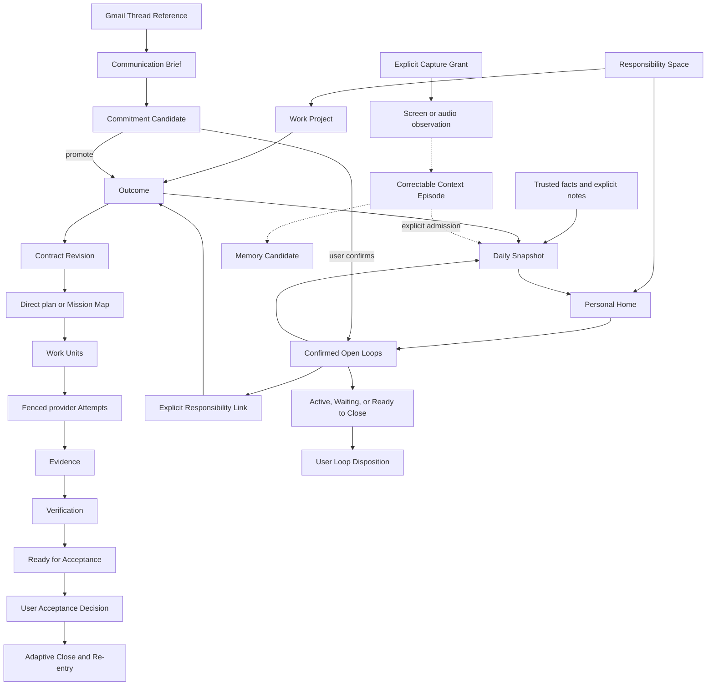
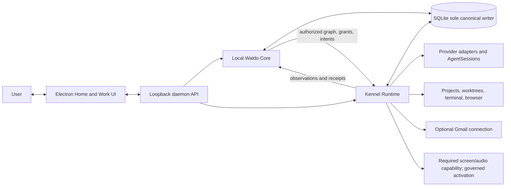

# Waldo Kennel v0 dogfood and provider-neutral v1 team review packet

- Status: v0 dogfood baseline amended by ADR 0004; provider-neutral v1 direction remains partly proposed; documentation and prototype only
- Date: 2026-08-20; Home/Personal Agent amendment accepted 2026-08-21
- Audience: founders, product, design, engineering, privacy, and security
- Canonical source: [desktop launch product architecture](kennel-v1-product-architecture.md)
- Implementation status: prerequisite foundation/provider/CLI cleanup is on `main`; accepted product ontology remains unimplemented

This packet is the shareable review view of the accepted Waldo Kennel local v0 dogfood. It combines the Kennel Work loop with a parallel local Personal Home lane, confirmed Open Loops, Daily Snapshot, required governed desktop screen/audio capture capabilities, candidate-memory foundations, and a bounded Gmail Communication Loops beta. Capture capability is required; activation remains explicit per user and modality. Codex-only execution is locked only for local v0 testing; v1 provider selection is Unknown/TBD and must use provider-neutral adapters. It is not a claim that the current prototype Outcome overlay implements these decisions.

Companion artifacts:

- [Clickable low-fidelity prototype](kennel-v1-review-prototype.html)
- [Excalidraw collaboration seed](kennel-v1-excalidraw-session-seed.md)
- [Canonical architecture](kennel-v1-product-architecture.md)
- [Local-first deployment decision](../adr/0003-local-first-waldo-core.md)
- [Parallel Home/Personal Agent and required capture decision](../adr/0004-parallel-home-personal-agent-and-required-capture.md)
- [Home, Personal Agent, capture, and memory design](../superpowers/specs/2026-08-21-home-personal-agent-memory-design.md)
- [PR convergence plan](../superpowers/plans/2026-08-20-pr-convergence-and-architecture-gate.md)

## 1. Evidence and decision labels

| Label | Meaning |
| --- | --- |
| **Locked** | Accepted for this architecture baseline; changing it requires another explicit decision. |
| **Observed** | Directly inspected in code, repository, API documentation, or a dry run. |
| **Reported** | Supplied by a person or external system but not independently reproduced here. |
| **Inference** | Evidence-based interpretation or likely consequence. |
| **Proposed** | Concrete design awaiting a future decision. |
| **Unknown** | Material detail not established. |

Messages, model text, commits, PRs, checks, screenshots, activity, and provider completion are never silently promoted from Observed to accepted user truth.

## 2. Executive decision

### Locked

- Waldo is one user-owned intelligence and responsibility identity. Kennel is its local Mac presence, not a separate assistant.
- The launch product has three primary destinations: **Home**, **Work**, and **Settings & Control**.
- The common product spine is five adaptive surfaces: **Enter -> Understand -> Decide & Authorize -> Act & Observe -> Prove & Close**. Destinations select context; they do not create competing workflows.
- The complete detailed screen atlas remains reviewable underneath those five surfaces. The stages organize the flow; they do not erase individual screens, interactions, or states.
- Work remains the execution spine for agent-heavy Mac users: Outcome to verified Acceptance with lower supervision cost. Its Local Focus Ledger scope remains unchanged.
- Home is a parallel Personal Agent lane adding confirmed Open Loops, trusted Daily Snapshot, concise attention, communication continuity, capture-derived correctable episodes, and exact Re-entry without claiming complete life understanding.
- Gmail Communication Loops is an optional bounded beta: read actionable threads, propose correctable commitments, confirm an Open Loop or Outcome, create a user-requested draft, track Waiting, and consciously close. It never auto-sends or auto-closes.
- Desktop screen and audio capture are required Personal Agent capabilities. Each modality is separately consented, local-first, visible, pausable, excludable, correctable, revocable, and deletable; activation is never mandatory and observations never become Memory/Evidence/authority automatically.
- Local Waldo Core runs inside the daemon. Electron is a thin supervisor. Local SQLite is the sole canonical writer.
- No account, hosted Waldo API, Waldo-funded model, or central Memory service is required for launch.
- **v0 only:** Codex is the only provider selectable for local dogfood Work Attempts. Historical provider identities remain readable and retain original identity.
- **Unknown/TBD for v1:** provider selection is not locked. Claude and other providers require an admitted adapter and conformance before becoming selectable; the core orchestration model remains provider-neutral.
- Provider completion, commits, PRs, checks, Verification, messages, and drafts never create Acceptance or Open Loop closure.
- All consequential effects have an EffectIntent before I/O and an EffectReceipt after reconciliation.
- Durable admitted Memory remains behind its admission/privacy/deletion/evaluation gate. Hosted attachment, Relationship, Health, phone/wearable implementation, durable proactive agent, Waldo-owned harness, teams, marketplace, and commercialization remain later.

### Observed

- F0-F6 already supplies an AO-derived Go daemon, trigger-based SQLite change events, Electron, Projects, worktrees, provider sessions, terminal/browser, recovery facts, and code-review observations.
- The current Outcome overlay is session-oriented and is not the accepted Outcome/Open Loop model.
- PR #11 mixed useful cleanup with an unwired permanent Outcome store that omitted required CDC, revision, evidence, acceptance, effect, and recovery semantics. Accepted donor work landed separately in PRs #12-#14.
- Gmail desktop access can avoid a Waldo backend through installed-app OAuth and incremental polling, but public inbox/draft scopes require Google verification.
- Dayflow proves useful local observation/timeline mechanisms; it does not prove intention, whole-life context, or governed durable Memory.

### Inference

- The coherent product is not “coding agents plus an inbox plus screenshots.” It is one governed responsibility system with multiple sources and bounded executors.
- Launch value comes from reducing coordination burden: less context reconstruction, fewer reducible interruptions, clearer authority, safer recovery, and faster conscious closure.
- Gmail broadens the proof from agent execution to human coordination, but should not delay the Work core if OAuth/privacy gates are not ready.
- The inherited agent/session/Kanban experience remains useful as an operational projection. Moving the canonical center from Session to Outcome makes session recovery and provider replacement possible without losing intent or proof.
- Omi/Minimi-like ambient continuity and Dayflow-like capture are now required Personal Agent architecture inputs. Captured activity still becomes candidate context until admitted into durable, correctable, provenance-bearing Memory.

## 3. Launch promise, users, and problems

> Give Waldo something that must become true—or something you cannot afford to forget. Kennel clarifies the responsibility, chooses the smallest safe next action, executes or drafts within explicit authority, returns Evidence instead of claims, and brings you back only for judgment, human-only action, or conscious closure.

| User/job | Problem today | Launch mechanism | Falsifier |
| --- | --- | --- | --- |
| Technical founder/developer delegates code work | Intent, plan, permissions, and proof are buried in sessions. | Outcome contract, Mission Map, Work Units, admitted provider Attempts, Evidence, Verification, Acceptance. | More supervision than direct Codex in v0 dogfood. |
| User returns after interruption | They reconstruct branches, sessions, messages, and next steps. | Causal trace, Recovery receipt, Daily Snapshot, Re-entry packet. | Full transcripts still required routinely. |
| User receives an important email | The actual ask, owner, due condition, and next action are unclear. | Communication Brief and correctable Commitment Candidate. | False commitments become canonical. |
| User waits on another person | A quiet thread is forgotten or incorrectly considered done. | Open Loop with owner, trigger, next review, and closure condition. | Archive/inactivity silently closes it. |
| User needs work-plus-personal continuity | A repository Project cannot represent every responsibility. | Personal Home Responsibility Space and explicit Quick Capture. | Product invents fake Projects or opaque life claims. |

## 4. Final ontology

### Roots and responsibility

| Object | Meaning | Never confuse with |
| --- | --- | --- |
| `ResponsibilitySpace` | Policy/context/retention boundary: Work Project or Personal Home. | UI tab, provider, account. |
| `Project` | Local executable workspace inside a Work Project space. | Outcome, personal area. |
| `Outcome` | Something the user delegates to become true. | Task, session, PR, message thread. |
| `OpenLoop` | Confirmed unresolved responsibility/commitment to revisit or close. | Inferred TODO, inactive thread, failed command. |
| `ContractRevision` | Immutable Outcome goal, criteria, constraints, authority, review, stop. | Editable chat summary. |
| `PlanRevision` | Versioned execution proposal. | Mission as a second Outcome. |
| `MissionMap` | Optional understandable projection of PlanRevision. | Canonical responsibility. |
| `LoopDisposition` | Immutable confirm/close/release/reopen/transfer decision. | Automatic status inference. |
| `SuccessorLink` | Explicit follow-up lineage. | Mutation of accepted/closed history. |
| `ResponsibilityLink` | Immutable explicit many-to-many lineage between one Home OpenLoop and one Work Outcome, with provenance, creator/reason, created time, and optional ended time/reason; duplicate active pairs are rejected. | Moving, merging, closing, verifying, accepting, or mutating either item. |

### Execution and control

| Object | Meaning | Invariant |
| --- | --- | --- |
| `WorkUnit` | Smallest bounded schedulable part of a plan. | Frozen requirements/evidence/recovery for each Attempt. |
| `Attempt` | One execution of one WorkUnit. | Retry/fallback creates another Attempt. |
| `AgentSessionRef` | Provider-native session reference. | Session completion is not Outcome completion. |
| `CapabilityGrant` | Scoped read/write/execute/disclose/spend/effect authority. | Lower layers may narrow, never widen. |
| `DecisionRequest` | Irreducible user judgment with recommendation and consequence. | Generic notification or error. |
| `EffectIntent` | Frozen proposed consequential action before I/O. | Tool call or model request. |
| `EffectReceipt` | Reconciled actual effect, including unknown. | Assumed success. |

### Proof and closure

| Object | Meaning | Invariant |
| --- | --- | --- |
| `EvidenceItem` | Provenance-bearing support/contradiction tied to a criterion and subject. | Provider assertion. |
| `VerificationRun` | Method/verifier/subject/result/exceptions. | Acceptance. |
| `AcceptanceDecision` | Immutable user accept/reopen decision. | Check pass or reviewer approval. |

### Communication and personal context

| Object | Meaning | Admission rule |
| --- | --- | --- |
| `IntakeSession` / `ClarificationRequest` | Shared adaptive Home/Work understanding and one material question. | Implemented once; proposals are not canonical. |
| `SourceConnection` | Explicitly authorized source such as one Gmail account. | Scope, disclosure, retention, revoke, and sync state visible. |
| `CommunicationThreadRef` | External conversation reference and provenance. | Never canonical responsibility identity. |
| `CommitmentCandidate` | Correctable inferred ask/obligation/owner/due/next step. | User confirms before OpenLoop/Outcome creation. |
| `DraftEffect` | Gmail-draft EffectIntent/Receipt. | Does not mean sent, acknowledged, or closed. |
| `DailySnapshot` | Time-bounded projection from trusted facts and confirmed items. | Not Memory, productivity scoring, or whole-life truth. |
| `CaptureGrant` | Purpose/scope/processing/retention/pause/revoke/delete contract for screen, audio, explicit, connector, or future device capture. | Required before a modality activates. |
| `SourceArtifact` | Captured/imported source identity, coverage, sensitivity, retention, and deletion generation. | Source existence is not truth. |
| `Observation` | Untrusted typed source observation from explicit, structured, screen, audio, connector, or future device capture. | Never authority, Evidence, or Memory automatically. |
| `ContextEpisode` | Correctable grouping of Observations. | Explicit link/admission required. |
| `MemoryCandidate` | Provenance-bearing durable-continuity proposal. | Admission, correction, counter-evidence, expiry, revocation, deletion required. |
| `MemoryRevision` | Immutable admitted claim with valid time, recorded time, scope, provenance, uncertainty, and expiry. | Enabled only after the durable-memory gate. |
| `DeletionTombstone` | Content-free generation fence preventing stale resurrection. | Survives index, job, checkpoint, and source replay. |

## 5. Unified lineage and governance graph

### Governance invariants

1. User statements outrank behavioral inference.
2. Model output proposes; deterministic daemon code validates and transitions.
3. No execution or effect begins without the current contract/grant/intent gate.
4. Provider/session state, communication activity, and desktop observation never become responsibility truth automatically.
5. Unknown effects are contained and reconciled before any retry.
6. Acceptance and LoopDisposition belong to the user.
7. Accepted/closed history is immutable; follow-up creates a successor.
8. Raw private sources stay local or cross a named disclosure boundary with explicit consent.

## 6. Local architecture and custody

| Local Waldo Core owns | Kennel Runtime owns |
| --- | --- |
| Responsibility/continuity semantics | Repository and workspace bytes |
| Contracts, plans, Work Units | Worktrees, processes, terminal/browser |
| Authority requirements and decisions | Provider auth, credentials, AgentSessions |
| Effect Intents, Evidence metadata, Verification | Raw artifacts, traces, source content, receipts |
| Acceptance, LoopDisposition, lineage | Recovery observation and reconciliation |
| Attention, Communication Brief, Daily Snapshot | Connector and governed screen/audio capture I/O |

Hosted Waldo is not a launch dependency. After an explicit future attachment, it may become canonical for the attached space's semantics and metadata; Kennel retains local execution/raw custody. Dual canonical writers are forbidden.

## 7. Final information architecture

### Home

The user sees responsibility and attention across spaces:

- Today brief and trusted Daily Snapshot;
- Needs You and Action Required;
- Open Loops, Waiting, follow-ups, and Ready to Close;
- actionable Communication Loops beta;
- Quick Capture and correction;
- recent accepted Outcomes and exact Re-entry.
- a calm daily brief and focused Catch Up pane whose suggestions can be dismissed, corrected, confirmed, or explicitly connected to Work.

Home is not an activity feed, raw inbox, screenshot timeline, or Memory dashboard.

### Work

- Projects and readiness;
- Outcome Focus, Active Outcomes, Waiting, Ready for Acceptance, and recent closes;
- Outcome Workspace: Define, Clarify, Mission Map, Authority, Run, Review, Accept, Close/Re-enter;
- incoming Home suggestions/Open Loops as drafts or explicit links; they do not become executable Outcome truth merely by appearing in Work;
- contextual operator inspector for Attempt, terminal, worktree, browser, trace, and recovery.

### Settings & Control

- Responsibility Spaces and Projects;
- v0 Codex admission/authentication, provider-adapter capability profiles, and historical-provider inspection;
- Gmail connections and sync/privacy/disclosure state;
- permissions, effects, retention, export, revoke, deletion;
- external skill/MCP catalogs remain distinct from the proposed Waldo Learning registry;
- governed Learning grants, source coverage, candidates, experiments, provisional/active Project bindings, invocation receipts, evaluation freshness, rollback, revoke, export, and deletion;
- required capture capabilities with per-modality grant/processing/retention controls;
- hosted attachment visibly Later.

## 8. Five-stage spine and complete screen atlas

The five surfaces organize the detailed atlas; they do **not** replace it. F01-F27 plus the inserted F02A Home-to-Work review frame remain concrete screen conversations for design and implementation.

| Surface | Primary question | Home modes | Work modes | Failure/attention modes |
| --- | --- | --- | --- | --- |
| **Enter** | What responsibility are we taking on, and where? | enter Home, Quick Capture, source candidate | Work-first onboarding, Project selection/readiness, Outcome entry | invalid folder, daemon offline, Codex unavailable |
| **Understand** | What is true, uncertain, and required? | Today/Catch Up, Daily Snapshot, Communication Brief, Open Loop detail | Work Home, Outcome Define, Clarify | stale/partial source, correction, duplicate, provenance inspect |
| **Decide & Authorize** | What approach is recommended, and what needs consent? | Connect to Work, Draft Review | direct unit/Mission Map, authority/effect/budget preview | capability blocked, invalidated plan, changed grant |
| **Act & Observe** | What is Waldo doing and where is attention useful? | Waiting/follow-up, reconciled draft effect | Run and Work Unit progress | Needs You, Action Required, Waiting, pause, retry, lost/recovery |
| **Prove & Close** | Is the current responsibility proved and consciously handled? | Ready to Close, Daily Close, release/reopen | Evidence, Verification, Acceptance, Adaptive Close | contradictory/stale evidence, dirty resources, successor, Re-entry |

Settings & Control and Operator Inspector are persistent overlays. They can be entered from any stage without changing responsibility state.

| Frame | Stage | Screen and user problem | Essential interactions and states |
| --- | --- | --- | --- |
| F01 | Enter | **First run:** begin useful local work without understanding providers or setting up Home. | Start with Work, Start with Home, Project selection, invalid folder, daemon offline, Codex unavailable, ready. |
| F02 | Understand | **Home / Today:** see what needs judgment, action, waiting, or closure now. | empty, normal, high attention, stale, offline, recovering, open source, correct/dismiss. |
| F02A | Decide & Authorize | **Connect Home to Work:** turn a candidate/Open Loop into related executable work without losing its source. | correct, keep Home-only, new Outcome draft, link existing, no Project, duplicate, cancel. |
| F03 | Enter | **Quick Capture:** preserve an explicit thought or responsibility immediately. | note/OpenLoop/Outcome choice, duplicate, ResponsibilitySpace, defer, cancel. |
| F04 | Understand | **Daily Snapshot:** reconstruct what changed and what remains open. | collecting, partial, ready, corrected, source inspect, Daily Close. |
| F05 | Enter | **Communication connection:** authorize one source without making it mandatory. | scope/disclosure/retention, authorize, denied, syncing, revoke, disconnected. |
| F06 | Understand | **Communication inbox:** see actionable conversation candidates instead of a raw inbox. | ready, empty, stale, syncing, uncertain, revoked, prompt-injection quarantine. |
| F07 | Understand | **Communication Brief:** understand the ask, owner, trigger, and recommended next action. | correct, dismiss, confirm OpenLoop, promote Outcome, inspect source. |
| F08 | Decide & Authorize | **Draft effect review:** approve the exact bounded communication effect. | intent, approve, edit, create, failed, unknown/reconciled, sent externally. |
| F09 | Understand | **Open Loop detail:** know owner, trigger, recheck, closure, provenance, and related Work. | active, waiting, deferred, ready to close, closed, released, reopened, transferred. |
| F10 | Prove & Close | **Ready to Close:** decide whether a Home responsibility is consciously handled. | evidence/change summary, close, release, reopen, promote remaining work. |
| F11 | Understand | **Work Home:** scan Outcomes and the next useful intervention while retaining dense orchestration visibility. | empty, active, Needs You, Action Required, Waiting, Ready for Acceptance, recovery. |
| F12 | Understand | **Outcome Define:** state what must become true and how success will be reviewed. | natural-language entry, vague success, conflict, local-only, draft revision. |
| F13 | Understand | **Adaptive clarification:** answer the one material question that changes the contract. | recommendation, alternative, custom answer, contradiction, defer. |
| F14 | Decide & Authorize | **Mission Map:** review the smallest sufficient agent/WorkUnit topology. | direct unit, sequential/parallel graph, dependencies, invalidated, capability/budget conflict. |
| F15 | Decide & Authorize | **Authority and effect preview:** understand what may happen, where, until when, and how to revoke. | grant, deny, changed revision, missing capability, effect intent, budget/placement. |
| F16 | Act & Observe | **Run:** see WorkUnits, Attempts, agents, Kanban state, current change, and next safe action. | queued, running, paused, failed, lost, reconciled, retry, partial Evidence. |
| F17 | Act & Observe | **Needs You:** resolve an irreducible judgment without reading the transcript. | recommendation, alternatives, rationale, consequence, expiry, inspect, defer. |
| F18 | Act & Observe | **Action Required:** complete an exact human-only action. | sign-in, permission, denial, completed elsewhere, recheck, resume. |
| F19 | Act & Observe | **Waiting:** understand why action is not useful yet and when to recheck. | dependency, external owner, timeout, provider recovery, manual refresh, transfer. |
| F20 | Prove & Close | **Evidence and Verification:** judge every current success criterion. | missing, stale, contradicting, passed/failed check, exception, verifier conflict. |
| F21 | Prove & Close | **Acceptance:** let the responsible user decide whether the Outcome is handled. | accept, request rework, revise active, release; never automatic. |
| F22 | Prove & Close | **Adaptive Close:** decide what history, worktree, artifact, or Open Loop remains. | dirty worktree, retain/clean later, unresolved item, successor suggestion. |
| F23 | Prove & Close | **Re-entry:** restore minimum exact context after interruption or successor creation. | reopened Outcome/OpenLoop, source missing, historical provider unavailable, handoff packet. |
| F24 | Overlay | **Operator Inspector:** inspect session, terminal, browser, worktree, trace, and recovery truth. | current/stale Attempt, fence, provider identity, raw local evidence, redaction, replay. |
| F25 | Decide & Authorize | **Capture grants:** separately approve screen, system-audio, microphone, processing, and disclosure. | disabled, permission denied, enabled, pause, exclusions, storage cap, local/cloud route, export, revoke, delete. |
| F26 | Understand | **Context episode correction:** fix what screen-derived context means before admission. | untrusted candidate, split/merge, correct, dismiss, link, expiry, source unavailable. |
| F27 | Overlay | **Settings & Control:** inspect, limit, export, revoke, or delete authority, data, and proposed governed Learning. | provider mismatch, connection revoke, retention, Learning denied/paused/stale/provisional/active/suspended/rolled back, export, delete, hosted attachment unavailable. |

The implementation may reuse layout primitives or routes across these frames, but a review cannot drop a frame's purpose, interactions, failure states, or lineage simply because it shares one of the five lifecycle stages.

## 9. End-to-end UX flows

### A. First run

1. Kennel explains local custody and recommends **Start with Work** for v0 dogfood.
2. The user selects a local Project, Kennel checks daemon/Codex readiness, and Enter opens the first Outcome.
3. **Start with Home** remains available, but no Personal Home is silently created and it is not a prerequisite for Work.
4. Capture activation, Gmail, an account, and hosted attachment are separately explained and never onboarding blockers. Screen/audio support is a required capability, but every modality remains disabled until explicitly granted.

### B. Daily Home

1. Home opens on the smallest current brief: what needs judgment, action, waiting, or closure.
2. Daily Snapshot uses trusted Kennel facts, confirmed items, and explicit notes.
3. The user can correct, dismiss, capture, defer, or open exact source context.
4. Daily Close records what remains open and creates tomorrow's Re-entry; it does not maximize closure count.

### C. Home to Work

1. Home's Morning Brief shows trusted current responsibility; Catch Up presents one correctable Suggested Next Action at a time.
2. The user may dismiss or correct the suggestion, confirm or keep an Open Loop, create a draft Outcome in a selected Work Project, or link the Open Loop to an existing Outcome.
3. A direct candidate-to-Outcome conversion preserves source/provenance. An Open Loop-to-Outcome connection records a `ResponsibilityLink`.
4. Linking never transfers, merges, closes, verifies, or accepts either side. The Home Open Loop retains its owner, recheck, and closure condition; the Work Outcome receives its own contract, Evidence, Verification, and Acceptance lineage.
5. Work shows the incoming draft/link and requires Goal, Success, Review, authority, and placement before execution.

### D. Work Outcome through the common spine

1. **Enter:** capture the Outcome in its selected Work Project.
2. **Understand:** keep Goal, Success, and Review visible; resolve one material ambiguity at a time into a frozen ContractRevision.
3. **Decide & Authorize:** recommend the smallest sufficient topology; compile simple work directly and expand Mission Map, authority, effects, and budget only as risk warrants.
4. **Act & Observe:** admit a fenced Attempt through the v0 Codex adapter; show Work Units, change, failure/recovery, and Waldo's next safe action rather than transcript volume.
5. **Prove & Close:** group Evidence by current criterion, label verifier independence truthfully, and let the user accept, request rework, revise, release, or create a successor/Open Loop.

### E. Communication Loop

1. User connects one Gmail account with explicit scope/disclosure/retention notice.
2. Kennel polls incrementally and shows only actionable candidates, not the whole inbox.
3. Communication Brief states the ask, owner, due/trigger, what happened, and Waldo's recommended next action.
4. User dismisses, corrects, confirms an Open Loop, or promotes to an Outcome.
5. If requested, an exact draft EffectIntent is reviewed and created; user sends from Gmail.
6. The Open Loop becomes Waiting with owner and recheck condition.
7. A reply or user update produces a concise change brief and next action.
8. Waldo proposes Ready to Close; user closes, releases, reopens, or promotes remaining work.

### F. Required governed Desktop Context capability

1. Kennel provides screen, system-audio, and microphone capture capabilities. The user separately enables each modality through a CaptureGrant covering purpose, processing route, provider disclosure, exclusions, retention, pause, revoke, export, and deletion.
2. Raw frames/audio remain local-first and short-lived; observations are untrusted and source gaps stay visible.
3. Episodes are correctable and never become responsibility, Evidence, rules, skills, or Memory automatically.
4. Explicitly confirmed episodes may inform a Daily Snapshot or Commitment Candidate.
5. Home and Work remain useful when a modality is denied, paused, unavailable, revoked, or deleted.

### G. Candidate-first local Memory

1. Ambient activity, messages, transcripts, explicit notes, and Outcome/Open Loop history create provenance-bearing `MemoryCandidate`s.
2. Waldo proposes what may be worth remembering; user statements and corrections outrank inference.
3. Admission records scope, source, valid time, freshness/review, expiry, and confirmation level.
4. SQLite holds canonical identity, lineage, relationships, admission, supersession, deletion generations, and projection checkpoints. Encrypted content-addressed blobs hold retained source material; FTS, embeddings, relationships, and daemon-owned Markdown are rebuildable projections.
5. Corrections create revisions; deletion advances a content-free generation fence, removes source and derived content, and prevents stale recovery or source replay from resurrecting it.
6. Retrieval can ground a RunBrief only below current explicit contract/authority and with visible provenance/freshness.

The Home lane may implement sources, episodes, candidates, review, deletion-generation fixtures, and retrieval evaluation in parallel with Work. Durable admitted Memory remains behind its separate architecture, privacy, deletion, threat-model, and evaluation gate.

## 10. Failure, privacy, and recovery

| Failure | Product response |
| --- | --- |
| Codex missing/unauthenticated | Action Required with exact step and completion signal; no Attempt admitted. |
| Capability mismatch | Replan within authority or Needs You; never pretend parity. |
| Lost process/restart | Fence stale writes, preserve worktree, reconcile effects, resume or create a new Attempt. |
| Dirty/overlapping worktree | Block destructive cleanup/competing ownership; serialize, replan, or ask judgment. |
| Verification failure | Keep Outcome active; bind failure to current criterion and rework affected Work Unit. |
| Effect result unknown | Stop repeats, query authoritative state, record unknown receipt, reconcile before retry. |
| Gmail auth/sync failure | Preserve local loops, mark source stale, give exact reconnect/revoke path; never infer closure. |
| Prompt injection in message/source | Treat all inbound content as untrusted data; source text cannot grant capabilities or issue instructions. |
| Desktop capture denied/paused | Keep Home useful from trusted Kennel facts; show partial source truth without pressure. |

Canonical traces exclude raw prompts, email bodies, files, terminal output, screenshots, credentials, health values, and model chain-of-thought. Private excerpts are explicit minimized local attachments. Disclosure destination, reason, and policy are inspectable. Canonical control/lineage metadata follows its responsibility until user deletion; redacted operational diagnostics expire after 30 days by default and may be shortened or disabled; raw private artifacts require an explicit save and expiry; deletion leaves only a content-free anti-resurrection generation marker.

## 11. Launch scope and sequence

### Launch core

1. Foundation acceptance and bounded extraction of PR #11 cleanup.
2. In parallel, the complete [Local Focus Ledger](kennel-v0-first-outcome-slice.md) Work slice and the [Home/Personal Agent](../superpowers/specs/2026-08-21-home-personal-agent-memory-design.md) vertical slices.
3. Work owns Outcome-to-Acceptance. Home owns PersonalHome/OpenLoop, Quick Capture, Today/Catch Up/detail/closure, required governed screen/audio capture, Context Episodes, and candidate-memory evaluation.
4. Shared intake, ResponsibilitySpace, ResponsibilityLink, RunBrief references, CDC, and generated API contracts land once through coordinated ownership.
5. Failure injection and paired evaluation for both lanes, followed by the broader 20-Outcome and Home continuity dogfood gate.

### Optional launch beta

9. One-account Gmail Communication Loops: brief, candidate, confirm, draft, waiting, close/re-entry.

The beta may remain internal while Google OAuth verification and model-disclosure/security assessment are unresolved. Work core must not wait on it.

### Durable-memory gate

10. Enable durable admitted Memory only after provenance, bitemporal correction, counter-evidence, expiry, revocation, deletion non-resurrection, cross-space isolation, and retrieval evaluation pass.

### Later ecosystem

- Hosted attachment and cross-device sync;
- governed durable local Memory after its gate, then optional hosted attachment;
- proposed consented Paxel-style LearningEpisodes plus AutoResearch-style bounded skill experiments, held-out evaluation, explicit promotion, invocation receipts, and rollback—never automatic promotion from traces;
- one durable Waldo agent across Kennel desktop and the Health-aware Waldo mobile presence, with phone/wearable sources through the same identity, consent, Memory, responsibility, deletion, and learning contracts;
- durable proactive Waldo, Waldo-owned harness, provider routing beyond v0;
- teams, marketplace, pricing, and commercialization.

## 12. Resolved architecture defaults

The final architecture review ranks local v0 priorities as: authority/correctness; durability/recovery; privacy/custody; comprehensibility; evolvability; responsiveness; then speculative scale. The system is intentionally a single-user, single-Mac modular daemon with one SQLite canonical writer. At higher local load, retained screen/audio media, derived-index rebuilds, provider/process concurrency, worktree/disk pressure, terminal/browser resources, and connector limits are expected to fail before loopback HTTP or SQLite throughput; capture cadence, bounded concurrency, backpressure, age/storage retention, projection checkpoints, and cleanup come before distributed services.

No remaining architecture choice blocks implementation planning for Work, Home, or the first three Learning subprojects. ADR 0006 fixes the final one-Waldo/multiple-presence direction while leaving hosted attachment, mobile implementation, and health processing behind later specifications. Exact capture cadence, performance/energy/storage limits, implementation evidence, durable-memory and skill-promotion gate results, and hosted/phone/wearable/provider decisions cannot be silently settled inside a feature PR.

- One fenced writer per worktree. Attempt authority renews silently until completion, pause/revoke, or confirmed recovery; a missed heartbeat is `unconfirmed`, not dead. Fences pause only new consequential effects and canonical mutations while ordinary reasoning, observation, exploration, and authorized local tactics remain free.
- Waldo recommends the smallest sufficient topology using model-proposed decomposition checked by a deterministic, inspectable Orchestration Policy. One direct Attempt is the default; parallel work uses isolated non-overlapping worktrees and explicit dependencies/integration.
- No silent provider fallback. v0 dogfood uses Codex only; any later handoff creates a new Attempt through an admitted adapter and any review required by a material authority or plan change.
- Every provider-neutral RunBrief core freezes IDs, objective, dependencies, workspace, grants/effects/disclosure, Evidence/Verification, budget, stop/recovery/handoff. It is grounded from approved contract and plan through verified facts to lower-trust candidate context; contradictions block compilation. The adapter compiles a provider-specific form that may narrow but never widen it.
- Admission is fail-closed on every Attempt start/resume. Required adapter capabilities block admission; optional capabilities enable only dependent routes. Historical identity remains immutable; later conformant recovery is selectable only after reconciliation and readmission.
- Effective authority is the intersection of approved policy, plan, grants, admitted capabilities, worktree ownership, and effect ceiling. Budgets cover time, retries, concurrency, storage, trustworthy cost, effects/disclosure, and human interruptions while leaving tactics free inside the envelope.
- Deterministic verification is preferred. Self-check, separate-session, cross-provider/model, and owner-walkthrough results are labeled truthfully; a fresh verifier is read-only and only the user accepts. v1's provider set remains Unknown/TBD, not the evaluator policy.
- Local worktree read/write/commands may be authorized; local commits must be explicit. No autonomous push, PR, comment, merge, deploy, publish, release, payment, destructive remote effect, or message send.
- Gmail draft creation requires a user-requested EffectIntent. Send/archive/delete/labels/closure are not automated.
- Causal trace is metadata-first and private-content-minimized.
- Canonical trace metadata follows responsibility retention; operational diagnostics default to 30 days; private artifacts are opt-in with expiry; deletion cannot silently resurrect content.
- Provider text may propose plans or rewritten context, but it never becomes orchestration truth by authorship alone; deterministic policy and user authority decide admission.

## 13. Dogfood acceptance and falsifiers

Before public launch, test at least 20 representative Outcomes against direct Codex use plus a smaller communication-loop set.

| Measure | Threshold |
| --- | --- |
| Active supervision | Median at least 30% lower than direct Codex. |
| Full transcript reconstruction | No more than 20% of Outcomes. |
| Attention precision | At least 80% necessary and correctly classified. |
| Evidence coverage | Every accepted criterion has current Evidence and Verification/exception. |
| False ready/reopen | No more than 10% due to omitted known material facts. |
| Injected recovery | At least 90% safely contained/reconciled without manual reconstruction. |
| Consequential effects | Zero unauthorized, duplicated, widened, or blindly retried effects. |
| Re-entry | Median under 60 seconds to identify state and next action. |
| Communication authority | Zero auto-created canonical commitments and zero auto-sent messages. |

Pause or falsify the wedge when coordination cost is not lower, users routinely need raw transcripts, readiness is misleading, effects cannot be explained/reconciled, or privacy/compliance makes the local-first claim untrue.

## 14. PR and implementation boundary

### PR convergence

1. PR #1/F0-F6 is accepted after a complete green local foundation gate.
2. PRs #12-#14 landed the accepted legacy-import, provider-admission, and CLI donor work as separate changes.
3. PR #11 remains superseded and must not merge wholesale.
4. Its speculative Outcome schema/store and locale deletion remain rejected until the first vertical slice owns domain, service, migration, CDC, API, UI, recovery, and evaluation together.
5. Historical provider identities and read paths remain preserved while unsupported new work fails closed.

### Feature branches

- Every product slice starts from current `origin/beta` in a separate worktree and opens its PR back to `beta`; promotion to `main` is a separate tested maintainer action.
- One issue and one end-to-end vertical boundary per PR.
- Work uses five stage-aligned PRs—Enter, Understand, Decide & Authorize, Act & Observe, Prove & Close—and each owns every daemon/domain/storage/CDC/API/UI/recovery/evaluation change its truth boundary requires.
- Home/Personal Agent uses separate vertical PRs for shell/fixtures; PersonalHome/OpenLoop/Quick Capture; Today/Catch Up/detail/closure; Home-to-Work/shared intake; required screen/audio capture; and candidate-memory review/retrieval evaluation.
- Before code, both lanes record exact file and API ownership. Shared contracts have one named integration owner; neither lane duplicates intake/Q&A, ResponsibilitySpace, ResponsibilityLink, RunBrief memory references, CDC semantics, or generated DTOs.
- Screens may be prototyped together, but canonical writes and state transitions land only with their daemon/domain/CDC contract.
- Start Work from the amended [Kennel First Outcome Execution Handoff](../superpowers/plans/2026-08-20-first-outcome-execution-handoff.md). Start Home planning from the [Home/Personal Agent design](../superpowers/specs/2026-08-21-home-personal-agent-memory-design.md).
- No feature edits belong on F0-F6.
- This packet does not authorize push, merge, deploy, publish, release, destructive cleanup, or hosted attachment.

## 15. Team Excalidraw review

Review in this order:

1. Does ResponsibilitySpace correctly separate Work Project and Personal Home without duplicating Waldo identity?
2. Can each source observation be traced to a candidate, user decision, canonical responsibility, and closure?
3. Are Outcome Acceptance and Open Loop closure visibly distinct?
4. Does Home show only what helps the next decision, not an activity dashboard?
5. Can every permission/effect be explained by placement, scope, consequence, and revoke?
6. Is Gmail genuinely optional, and are required capture capabilities clearly distinguished from explicit user-controlled activation with honest privacy/compliance behavior?
7. Does each former screen behave as a mode of one of the five surfaces, or can it be removed?
8. What would cause the team to stop building or change the launch wedge?

Record contradictions, missing states, and removable surfaces against the numbered frames in the Excalidraw seed. Team review may simplify presentation, but it must not weaken authority, Evidence, Acceptance, closure, privacy, or recovery invariants.
