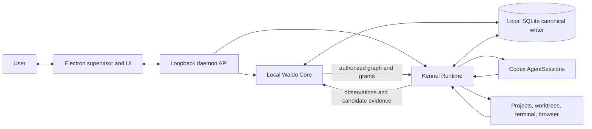

# Kennel v1 team architecture review packet

- Status: Team review packet; documentation and prototype only
- Design baseline: `af31a719` plus the Codex-only launch-provider decision
- Date: 2026-08-20
- Audience: founders, product, design, and engineering
- Implementation status: not implemented

This is the self-contained review packet for the launchable shape of Kennel v1. It consolidates the accepted product direction, makes the interaction model reviewable, and isolates the decisions that still block feature implementation. It does not replace the foundation acceptance record, authorize a migration, or claim that the current prototype Outcome overlay implements this architecture.

Companion artifacts:

- [Clickable low-fidelity prototype](kennel-v1-review-prototype.html)
- [Excalidraw collaboration seed](kennel-v1-excalidraw-session-seed.md)
- [Accepted architecture baseline](kennel-v1-product-architecture.md)
- [Local-first deployment decision](../adr/0003-local-first-waldo-core.md)
- [PR convergence and architecture gate](../superpowers/plans/2026-08-20-pr-convergence-and-architecture-gate.md)

## 1. Evidence and decision labels

| Label | Meaning in this packet |
| --- | --- |
| **Locked** | Explicitly accepted for this design baseline. Changing it requires a new decision. |
| **Observed** | Directly present in the repository, a dry run, or other inspected evidence. |
| **Reported** | Supplied by a person or external system but not independently reproduced in this packet. |
| **Inference** | The team's evidence-based interpretation of the problem or likely consequence. |
| **Proposed** | A concrete design candidate awaiting explicit approval. |
| **Unknown** | Material detail that has not been established. |

No provider marketing claim, process state, agent self-report, commit, pull request, check, or artifact is treated as proof of user success.

## 2. Executive decision summary

### Locked

- Kennel launches for agent-heavy Mac users who already use coding agents and need to delegate an Outcome without carrying the coordination state themselves.
- The proof is **Outcome to verified acceptance with lower coordination and supervision cost**, not more agents, more sessions, or faster token generation.
- A Local Waldo Core runs inside the existing Go daemon. Electron remains a thin supervisor and UI. Local SQLite is the sole canonical writer in v1.
- Waldo owns responsibility and control-plane meaning. Kennel Runtime owns local execution and workspace custody.
- The user owns acceptance. Provider completion, commits, PRs, checks, and verification cannot accept an Outcome.
- A simple Outcome may compile to one Work Unit. A non-trivial Outcome may expose an optional Mission Map backed by a versioned `PlanRevision`.
- Codex is the only provider selectable for new v1 work, intentionally narrowing variability for better testing.
- Other provider identities remain historical and readable but non-selectable for new work. Original provider identity is never rewritten.
- Codex admission is live, fail-closed, and bound to every Attempt start or resume; a readiness badge is not authority.
- Required capabilities block admission when absent. Optional model, subagent, structured-output, checkpoint, cost, browser, or MCP capabilities only remove dependent topology choices.
- Compatibility is capability-first: known-bad versions are blocked, while an unrecognized version may run provisionally only after every required check passes.
- Historical Codex sessions require exact binding, reconciliation, and readmission. Historical non-Codex sessions are inspect-only and hand off through a provenance-bearing packet to a new Codex Attempt.
- Hosted attachment, Memory as a product surface, Relationship, Paxel learning, broad providers, teams, mobile, and commercialization are later.

### Observed

- The F0-F6 chassis already contains an AO-derived Go daemon, SQLite with trigger-based change events, an Electron supervisor, projects, worktrees, provider sessions, terminal/chat/browser surfaces, recovery facts, and PR/check/review observation.
- The present Outcome overlay is a provider-session-oriented prototype, not the accepted Outcome/Mission model.
- A live dry run exposed planner/worker preference conflation, stale provider-readiness reporting, a TUI-to-Chat recovery failure, and no single redacted Outcome-to-acceptance trace.
- PR #11 combines useful cleanup with an unwired Outcome schema/store and unapproved surface narrowing, so it is not a valid implementation of this packet.

### Reported

- GitHub Actions currently expose no checks for the relevant pull requests.
- The latest complete foundation run hit a full-suite timing failure in `TestFullLifecycleSpawnToTermination`; the isolated test passed three of three runs. The foundation gate is therefore not green.

### Inference

- The product advantage comes from responsibility transfer, judgment compression, truthful authority, and recoverable evidence—not a provider dashboard.
- Codex-only launch admission makes failures easier to attribute while the control loop is still being proved.
- Outcome-first hierarchy should reduce transcript reconstruction and hide infrastructure detail until it affects a decision, permission, failure, or recovery.

## 3. Product thesis

### The promise

Give Kennel something that needs to become true. Kennel helps make the responsibility explicit, shows the proposed work and authority before execution, runs bounded Codex Attempts locally, interrupts only for irreducible judgment or human action, and returns criterion-bound evidence for verification and conscious acceptance.

### Launch wedge

The first users are agent-heavy Mac developers and technical founders working in local repositories. They already know how to start Codex sessions; their problem is supervising several incomplete, interrupted, or ambiguously finished responsibilities across sessions and worktrees.

### Users, jobs, and current problems

| User/job | Current problem | Desired progress |
| --- | --- | --- |
| Delegate a meaningful coding responsibility | The request is underspecified, and success exists only in the user's head. | A versioned Outcome contract makes success, constraints, authority, and stopping conditions inspectable. |
| Let an agent work without constant steering | Plans, permissions, and execution are mixed inside transcripts. | A small approved Work Unit graph runs within explicit bounds. |
| Know when intervention is actually needed | Raw session activity and notifications create noise. | Needs You, Action Required, and Waiting distinguish judgment, human-only action, and passive dependency. |
| Know whether work is truly done | Provider completion, a commit, or green checks can be mistaken for success. | Evidence is grouped by criterion; verification is separate; only the user accepts. |
| Recover after interruption or provider failure | The user reconstructs intent, worktree state, and next steps manually. | Durable Attempts and recovery use contain, reconcile, and narrow retry with exact re-entry context. |
| Continue after an accepted result | Follow-up work gets appended to old sessions and muddies history. | Accepted history stays immutable; follow-up creates a successor Outcome. |

### Feature-to-problem mapping

| Product mechanism | Problem addressed | User-facing result | Boundary |
| --- | --- | --- | --- |
| Guided Outcome definition | Success and scope are implicit. | Goal, Success, and Review are always visible; Plan and Authority appear when warranted. | Clarification is an interaction, not a canonical aggregate. |
| Contract revisions | Scope changes disappear into chat. | Material change creates a reviewable new version and invalidates affected work. | Accepted history is immutable. |
| Optional Mission Map | Multi-step work is difficult to assess before execution. | The user can inspect deliverables, dependencies, roles, risks, evidence, and gates. | Mission Map projects `PlanRevision`; it is not a second responsibility object. |
| Work Units and RunBriefs | Prompts lack stable boundaries and recovery context. | Each Attempt receives a scoped, versioned execution packet. | Detailed compilation contracts remain partly unapproved. |
| Capability grants | Agent access is broader or less legible than the work needs. | Read, write, execute, disclose, spend, and external-effect authority are explicit. | Consequential-effect ceiling remains unknown. |
| Attention projections | Every issue looks like a notification. | The surface says whether judgment, action, or waiting is required and why. | Labels are derived from durable facts. |
| Evidence and verification | Agent self-report is treated as truth. | Results are organized against the accepted success criteria. | Verification never becomes acceptance. |
| Acceptance and Adaptive Close | “Done” is ambiguous and follow-up is mixed into history. | The user accepts, reopens, releases, or creates a successor. | Only an immutable `AcceptanceDecision` accepts. |
| Operator inspector | Simplicity can hide important execution facts. | Sessions, terminal, worktree, browser, trace, and recovery stay inspectable. | Operational detail does not become product truth. |

### Falsifiers

The launch thesis is weakened if users still reconstruct full transcripts, cannot explain what authority was granted, receive frequent reducible interruptions, cannot tell why evidence satisfies a criterion, or need more supervision than direct Codex use. Exact thresholds remain **Unknown** and must be approved in the dogfood gate.

## 4. Final ontology

### Canonical entities and value objects

| Object | Canonical owner | Definition and invariant |
| --- | --- | --- |
| `Project` | Local daemon | Workspace and policy boundary; later hosted attachment occurs here. |
| `Outcome` | Local Waldo Core | User-delegated responsibility and immutable lineage root. It is not a provider session or PR. |
| `ContractRevision` | Local Waldo Core | Immutable goal, criteria, constraints, review expectation, authority envelope, and stop conditions. |
| `PlanRevision` | Local Waldo Core | Versioned execution proposal; optionally shown as a Mission Map. |
| `WorkUnit` | Local Waldo Core | Smallest schedulable unit with dependencies, capabilities, evidence, verification, stop, and recovery policy. |
| `Attempt` | Shared semantic boundary; persisted by daemon | One execution of one Work Unit. Retry or provider switch creates a new Attempt. |
| `AgentSessionRef` | Kennel Runtime custody | Stable reference to the provider-native session used by an Attempt. |
| `CapabilityGrant` | Local Waldo Core; enforced by Kennel Runtime | Explicit scoped permission to read, write, execute, disclose, spend, or create an effect. |
| `DecisionRequest` | Local Waldo Core | Irreducible user judgment with recommendation, rationale, consequence, override, and inspect path. |
| `EvidenceItem` | Local Waldo Core metadata; Kennel raw custody | Provenance-bearing observation or artifact tied to a criterion and evaluated subject. |
| `VerificationRun` | Local Waldo Core | Method, verifier identity/independence, subject revision, result, and exceptions. |
| `AcceptanceDecision` | User via Local Waldo Core | Immutable accept or reopen decision. No automated actor may create acceptance. |
| `SuccessorLink` | Local Waldo Core | Explicit lineage from an accepted Outcome to a later follow-up Outcome. |

### Projections and interactions, not canonical aggregates

- clarification;
- Mission Map;
- Needs You, Action Required, Waiting, and Ready for Acceptance;
- current session status;
- recovery receipt;
- re-entry packet;
- Project Follow-up / Keep for later;
- provider readiness display;
- operator inspector views.

These are derived from canonical records and durable operational facts. They are never written as competing truth.

## 5. Exact lineage

```text
Project
  -> Outcome
  -> ContractRevision
  -> PlanRevision (optional visible Mission Map)
  -> WorkUnit(s) + dependencies
  -> CapabilityGrant(s)
  -> Attempt(s)
  -> AgentSessionRef per Attempt
  -> EvidenceItem(s) per criterion and subject revision
  -> VerificationRun(s)
  -> Ready for Acceptance projection
  -> AcceptanceDecision
  -> Adaptive Close
  -> optional SuccessorLink -> new Outcome
```

Rules:

1. Pre-execution edits create a new contract and matching plan revision.
2. Material changes during execution create a revision and invalidate only affected plans, grants, work, evidence, or verification.
3. Low-risk reversible mechanics may be recompiled inside the approved envelope; the exact threshold is still **Unknown**.
4. Retries and provider handoffs create new Attempts; history is never rewritten.
5. Evidence always identifies its criterion and subject revision.
6. Verification always identifies method, subject, result, exceptions, and verifier independence.
7. Acceptance is explicit and immutable. Re-entry after acceptance creates a successor Outcome.

## 6. Governance, authority, custody, permissions, effects, verification, and acceptance

### Locked governance rules

- The user is the authority root and owns acceptance.
- Model output may propose a contract, plan, routing choice, interpretation, or recovery. Deterministic daemon code validates and performs state transitions.
- No execution begins until required contract, plan, and authority gates are satisfied.
- Lower layers may narrow authority but never widen it.
- Material scope, cost, permission, disclosure, external-effect, or success-criterion changes require renewed user review.
- Provider status, process exit, commits, PRs, checks, reviewer output, and verification are evidence or observations only.
- Unknown external effects are reconciled before retry; they are never blindly repeated.
- Durable product changes flow through daemon services and SQLite-triggered `change_log`; the renderer is not a second writer.

### Custody boundary

| Local Waldo Core | Kennel Runtime |
| --- | --- |
| Outcome and contract meaning | Workspace and repository bytes |
| Plan revisions and Work Units | Worktrees and local filesystem placement |
| Authority requirements and grants | Provider authentication and credentials |
| Decisions and attention meaning | Codex processes and AgentSessions |
| Evidence metadata, digests, and criterion links | Raw artifacts, traces, terminals, and browser sessions |
| Verification results and acceptance | Recovery observations and runtime reconciliation facts |
| Successor lineage | Unselected artifacts and operational caches |

### Permissions and effects

Capability grants must be explicit, scoped, inspectable, revocable, and frozen for an Attempt. The product must distinguish reading, writing, execution, disclosure, spending, and consequential external effects.

**Unknown:** the v1 effect ceiling. The team has not decided whether an admitted Attempt may only modify local worktrees, may create a local commit, may draft or open a pull request, or may perform any other external effect before a distinct approval.

### Verification and acceptance

- Evidence answers “what supports or contradicts this criterion?”
- Verification answers “what method evaluated which revision, with what result and exceptions?”
- Acceptance answers “does the user agree that this responsibility is handled?”
- A failed verification returns affected Work Units to rework or presents an explicit exception. It does not silently change the contract.
- An accepted Outcome can only be followed by a new successor; it cannot be mutated back into active history.

## 7. System architecture



### Local Waldo Core responsibilities

- Outcome, contract, plan, and lineage services;
- orchestration policy and Work Unit compilation;
- authority admission requirements and decision requests;
- evidence classification, verification records, and acceptance gates;
- derived attention and re-entry projections;
- provider-specific RunBrief compilation.

### Kennel Runtime responsibilities

- Codex installation/auth/readiness probes at the execution boundary;
- provider-native session start, resume, pause, cancel, and observation;
- worktree allocation, ownership, overlap protection, and cleanup policy;
- terminal, browser, process, artifact, and raw trace custody;
- capability enforcement, effect reconciliation, and recovery facts;
- translation of runtime events into durable observations.

### Deployment invariants

- Primary daemon listener remains unauthenticated and bound to `127.0.0.1`.
- All app state remains under `~/.kennel`, subject to documented overrides.
- Electron never writes around daemon service boundaries.
- Hosted Waldo and account creation are not launch prerequisites.
- Future attachment must choose one canonical authority; dual writers are forbidden.

## 8. Orchestration and RunBrief understanding

### Locked

- Waldo selects the smallest sufficient topology based on uncertainty, coupling, risk, capability, evidence needs, cost, latency, and reversibility.
- A simple Outcome may compile directly to one Work Unit.
- Non-trivial work may expose a Mission Map and compile to a more detailed graph.
- Every execution is an Attempt against a frozen Work Unit and contract/plan revision.
- Codex is the only new-work provider in v1.
- Provider-native strengths remain available behind shared capability and event contracts; the product must not imply unsupported parity.
- Before every Attempt start or resume, Kennel authoritatively checks compatible executable/protocol, current authentication, stable session identity, requested mode, start/resume/pause/cancel, ordered events, Project/worktree binding, Attempt correlation, and required local evidence capture.
- Admission is fail-closed for required capabilities. Optional model pinning, native subagents, structured output, checkpoint export, cost/token reporting, browser automation, and MCP-specific capabilities only enable dependent routes.
- Version policy is capability-first: record the version, block known-bad versions, and admit an unrecognized version provisionally only if every required live check succeeds.
- Historical Codex resume requires exact Attempt binding, workspace/effect reconciliation, and fresh admission. Historical non-Codex sessions are inspect-only; continuation creates a new Codex Attempt from explicitly selected, provenance-bearing recovery context.

### RunBrief minimum understanding

Every Work Unit receives a versioned, Codex-specific `RunBrief` that identifies:

- Outcome, ContractRevision, PlanRevision, WorkUnit, and Attempt;
- exact objective, inputs, constraints, and non-goals;
- dependency results and workspace/worktree snapshot;
- capability/effect envelope and disclosure boundary;
- expected outputs and criterion-bound evidence;
- verification method and evaluator boundary;
- stop, escalation, lease/fence, retry, recovery, and handoff rules.

This is an accepted semantic outline, not a final wire schema.

### Proposed, not approved

- Freeze one capability manifest and budget envelope per Attempt.
- Use leases and monotonically increasing fences so stale sessions cannot write current results.
- Permit automatic fallback only for low-risk reversible mechanics within the same approved capability and budget envelope.

### Unknown and launch-blocking

- lease duration, renewal, fencing, and stale-event rules;
- routing and fallback thresholds, cost/budget representation, and concurrency ceiling;
- worktree overlap and ownership policy for concurrent Work Units;
- evaluator-independence requirements and whether Codex may verify its own Attempt;

## 9. State machines

### Outcome responsibility

```text
Draft -> Contracted -> Active -> Ready for Acceptance -> Accepted
                      |                 |
                      |                 -> Reopened -> Active
                      -> Superseded / Released
```

`Completed` is not an Outcome state. Acceptance requires the user's immutable decision.

### Work Unit

```text
Proposed -> Ready -> Admitted -> Running -> Verifying -> Satisfied
                                  |             |
                                  |             -> Rework -> Ready
                                  -> Failed / Superseded
```

### Attempt

```text
Queued -> Running -> Paused -> Succeeded
                  |         -> Failed
                  |         -> Cancelled
                  -> Lost -> Reconciled -> narrow retry or human attention
```

### Attention projections

| Projection | Meaning | Required content |
| --- | --- | --- |
| Needs You | Materially different valid paths require user judgment. | Problem, recommendation, why, consequence, primary action, override, inspect path. |
| Action Required | One exact human-only action is required. | Action, location, reason, completion signal, resume behavior. |
| Waiting | A dependency or timed condition is unresolved; action now would not help. | Dependency, owner/source, recheck condition, release behavior. |
| Ready for Acceptance | Required evidence and verification exist for the current contract revision. | Criteria, supporting and contradicting evidence, verification result, exceptions, accept/reopen actions. |

## 10. Failure and recovery model

Recovery follows **contain -> reconcile -> narrowly retry**.

| Failure | Contain | Reconcile | Resume or escalate |
| --- | --- | --- | --- |
| Codex not installed or unauthenticated | Do not admit the Attempt. | Run authoritative local preflight. | Action Required with exact sign-in/install step. |
| Capability mismatch | Prevent unsupported topology/effect. | Compare required and observed capability profile. | Replan inside authority or Needs You for material change. |
| Process lost or app restarted | Fence stale writes and preserve worktree. | Inspect durable facts, process state, workspace, and effects. | Resume only when safe; otherwise create a new Attempt. |
| Session mode transition fails | Keep current mode and queue contained. | Determine whether the command was delivered or had effects. | Retry transition narrowly or expose Action Required. |
| Worktree dirty or overlaps another Attempt | Block destructive cleanup or competing ownership. | Attribute files and active owner. | Serialize, replan, or request judgment. |
| Check or verification fails | Keep Outcome active. | Bind failure to criterion and subject revision. | Rework affected Work Unit; preserve failed evidence. |
| Effect outcome unknown | Stop repeated effects. | Query authoritative external/local state. | Record receipt, request judgment, or retry only after certainty. |
| Historical provider session | Keep identity and history unchanged; non-Codex remains non-selectable. | Historical Codex: bind, reconcile, and readmit. Non-Codex: inspect and select explicit recovery context. | Resume the exact Codex Attempt only when safe; otherwise create a new Codex Attempt with provenance. |

Non-material recovery remains in history. Material recovery creates a compact receipt. Human responsibility becomes Needs You or Action Required, never a vague error banner.

## 11. Information architecture and screen inventory

Kennel has three primary destinations: **Work Home**, **Outcome Workspace**, and **Settings & Control**. The operator inspector is a contextual drawer, not another top-level product.

| Screen/state | User job | Primary content and actions | Required edge states |
| --- | --- | --- | --- |
| Onboarding / Project selection | Choose where local work happens and establish readiness. | Local folder, project name, Codex readiness, data-custody note, Continue. | No folder, invalid repository, Codex absent, authentication required. |
| Work Home | See responsibilities and the next useful intervention. | Outcome Focus, Active, Needs You, Action Required, Waiting, Ready for Acceptance, recent closes. | Empty, offline daemon, stale projection, recovery in progress. |
| Outcome Define | State what needs to become true. | Goal, Success, Review; optional constraints and non-goals. | Vague success, conflicting constraints, local-only requirement. |
| Outcome Clarify | Resolve only material ambiguity. | One adaptive question, Waldo recommendation, answer choices, inspect context. | Skip/defer, contradiction, changed scope. |
| Mission Map | Understand proposed work before execution. | Work Units, dependencies, roles, topology rationale, evidence, risk, budget, edit/approve. | Direct one-unit plan, invalidated revision, blocked capability. |
| Authority Preview | Understand exactly what execution may do. | Read/write/execute/disclose/spend/effect grants, placement, expiration, revoke. | New permission, external effect, missing authentication. |
| Run | Track progress by Work Unit rather than transcript volume. | Current unit, concise state, next-best action, Attempts, evidence progress, Pause. | Lost session, retry, stale Attempt, partial evidence. |
| Needs You | Make an irreducible judgment. | Recommendation, rationale, consequences, primary choice, override, inspect. | Decision expires, contract changes, competing valid paths. |
| Action Required | Complete one human-only action. | Exact action/location/reason/completion signal/resume behavior. | Sign-in failed, permission denied, action completed elsewhere. |
| Waiting | Understand why no action is useful yet. | Dependency, owner/source, recheck rule, cancel/revise. | Timeout, dependency failure, manual refresh. |
| Evidence & Verification | Judge results against success criteria. | Per-criterion evidence, provenance, verifier, failed checks, exceptions, raw inspect. | Missing evidence, stale subject revision, verifier conflict. |
| Acceptance | Consciously accept or reopen. | Contract summary, verification result, exceptions, Accept, Request rework, Release. | Partial acceptance is not implied; material exception requires decision. |
| Adaptive Close | Decide what happens after acceptance. | Close receipt, keep-for-later notes, suggested follow-up, release local resources. | Dirty worktree, retained artifact, unresolved open loop. |
| Re-entry / Successor | Start follow-up without mutating accepted history. | Re-entry packet, inherited context, new goal/criteria, link to predecessor. | No follow-up, changed Project, unavailable historical provider. |
| Operator Inspector | Inspect operational truth when needed. | Codex session, terminal/chat, worktree, browser, capabilities, events, trace, recovery. | Raw-data privacy warning, stale stream, unavailable session. |
| Settings & Control | Configure projects, Codex, permissions, and local data. | Project roots, Codex auth/readiness, routing override, skills/MCP, defaults, export/revoke. | Unsupported capability, deletion confirmation, future attachment marked unavailable. |

## 12. End-to-end UI/UX flows

### A. First run and project readiness

1. User selects a local folder; Kennel explains that repository bytes and raw sessions remain local.
2. Kennel performs Codex readiness checks at the actual execution boundary.
3. If ready, the Project opens at Work Home. If not, Action Required gives one exact install or sign-in step and the completion signal.
4. No account, cloud sync, model picker, MCP vocabulary, or API key is required in the primary path.

### B. Define and clarify an Outcome

1. Outcome Focus accepts ordinary language.
2. Define always exposes Goal, Success, and Review. Plan and Authority appear only when warranted.
3. Waldo asks one material clarification at a time and explains why it matters.
4. The user reviews the immutable ContractRevision before planning or execution.

### C. Review the Mission Map and authority

1. A simple Outcome shows one direct Work Unit; non-trivial work shows the smallest understandable Mission Map.
2. The user inspects dependencies, evidence expectations, verification, risk, and routing rationale.
3. Authority Preview separates read, write, execute, disclose, spend, and external effects.
4. Approval authorizes only the displayed revision and grants. Editing creates a new revision.

### D. Run and intervene

1. Kennel admits a Codex Attempt only after the approved gates and capability checks.
2. Run shows Work Unit progress and the next useful action, not transcript activity as success.
3. Needs You appears only for material judgment; Action Required for exact human-only steps; Waiting when no action is useful.
4. The operator inspector exposes sessions, terminal, worktree, browser, capability, and recovery facts without changing canonical Outcome truth.

### E. Review, verify, and accept

1. Evidence is grouped by current ContractRevision criterion and subject revision.
2. Verification identifies method, verifier independence, result, failures, and exceptions.
3. The user accepts, requests rework, revises while active, or releases.
4. No automated event creates acceptance.

### F. Adaptive Close and re-entry

1. Acceptance produces an immutable close receipt.
2. Adaptive Close offers deliberate cleanup, Keep for later, or a follow-up suggestion.
3. Follow-up creates a new Outcome and `SuccessorLink`, with a compact re-entry packet and no mutation of accepted history.

### Interaction principles

- Outcome-first, not session-first.
- Xirp-like simplicity: local Projects and native provider behavior remain understandable without exposing infrastructure by default.
- One primary reading path and action per state.
- Calm grayscale hierarchy; state is never communicated by color alone.
- Progressive disclosure for topology, provider, worktree, terminal, MCP, skills, and recovery detail.
- Every consequential action shows placement, scope, consequence, and revoke behavior.
- Every async state says what Kennel is waiting for and what will happen next.
- The user never needs to read a full transcript to resolve an attention state.

## 13. Launch scope, later scope, and non-goals

### Required for the first proof

- local Project selection and Codex readiness;
- guided Outcome definition and versioned contract;
- direct plan or optional Mission Map;
- Work Units, Codex RunBriefs, capability grants, and local admission;
- Codex Attempts with worktree and recovery custody;
- Needs You, Action Required, and Waiting;
- criterion-bound evidence and verification;
- explicit acceptance, immutable close, and successor re-entry;
- redacted Outcome Trace and dogfood instrumentation.

### Deliberately later

- hosted attachment, backup, cross-device sync, and remote execution;
- Waldo-funded inference or a centrally operated fallback model;
- Memory as a product surface, Relationship, and life-plus-work Open Loops;
- Paxel/AutoResearch trace learning or automatic skill promotion;
- providers other than Codex for new work;
- mobile, teams, marketplace, and commercialization.

### Non-goals

- generic multi-agent dashboard;
- provider launcher or lowest-common-denominator chat wrapper;
- prompt rewriting presented as orchestration;
- transcript archive or activity/productivity score;
- automatic acceptance based on provider completion or checks;
- required account, hosted backend, or cloud upload;
- copying proprietary prompts, engines, scoring systems, or visual language;
- implementing the unwired PR #11 Outcome schema by default.

## 14. Evidence boundaries and open gates

### Locked now

- Product thesis, launch wedge, local-first topology, ownership/custody split, ontology, lineage, attention contract, screen hierarchy, Codex-only new-work provider set, acceptance authority, and broad launch/later boundary.

### Resolved

1. **Codex admission and historical recovery:** strict per-Attempt admission, required/optional capabilities, capability-first version handling, historical Codex reconciliation/readmission, and inspect-only non-Codex handoff are locked.

### Still unapproved and launch-blocking

2. **RunBrief and orchestration contracts:** wire schema, leases/fences, routing/fallback, cost/budget, capabilities/effects, worktree concurrency, and evaluator independence.
3. **Redacted Outcome Trace:** event schema, correlation identifiers, retention, minimization, export, deletion, and debugging access.
4. **Dogfood proof:** measures, thresholds, task suite, failure injections, supervision accounting, and falsifiers.
5. **Consequential-effect ceiling:** local edits, commits, draft/open PRs, network effects, spending, and the approval boundary for each.

Hosted attachment offline/sync/detach/revoke/delete semantics are deferred because v1 is fully local-first.

## 15. Team review questions

The team should review these in order and record one decision at a time:

1. Which RunBrief fields and lease/fence rules are mandatory for the first vertical slice?
2. Can Codex verify its own Attempt in v1, and if so, what deterministic check or independent boundary prevents self-attestation from becoming truth?
3. What redacted event set is sufficient to reconstruct an Outcome without retaining raw prompts, private files, or terminal content?
4. What dogfood threshold proves lower supervision cost than direct Codex use, and what result falsifies the wedge?
5. What is the highest effect v1 may perform before a separate, just-in-time approval?
6. Does every prototype screen preserve Outcome-first hierarchy and one obvious next action?
7. Is any canonical object actually a projection, or any projection being treated as durable truth?

## 16. Review and implementation gate

Reviewers should annotate this packet and the clickable prototype with contradictions, missing states, unclear authority, and unnecessary surface area. Approval of this packet does not itself authorize feature implementation.

Before the first Outcome migration or vertical slice:

- PR #1/F0-F6 must be accepted from a green complete gate;
- gates 2-5 above must be explicitly approved;
- an issue-sized vertical-slice plan must enumerate domain, service, storage, CDC, API, frontend, recovery, and evaluation changes;
- the user must explicitly authorize implementation of that plan.
